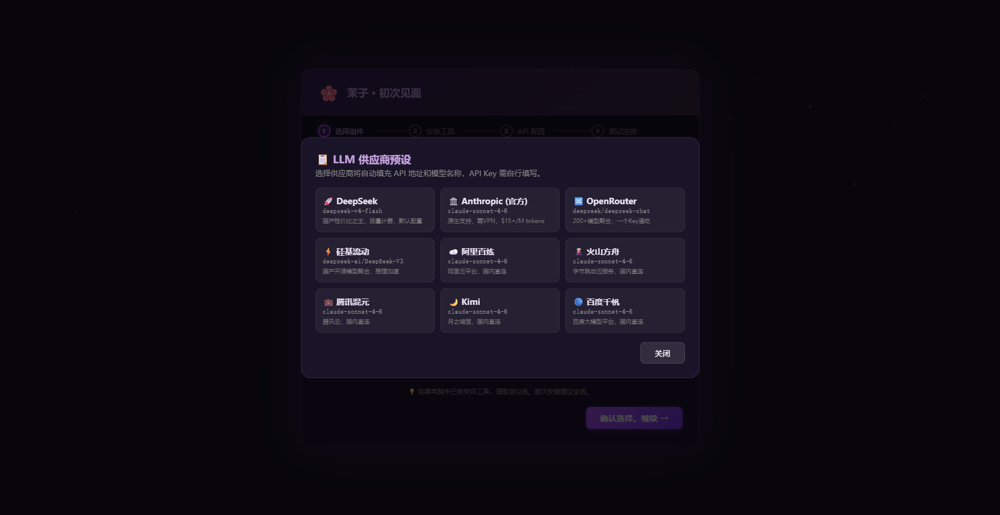
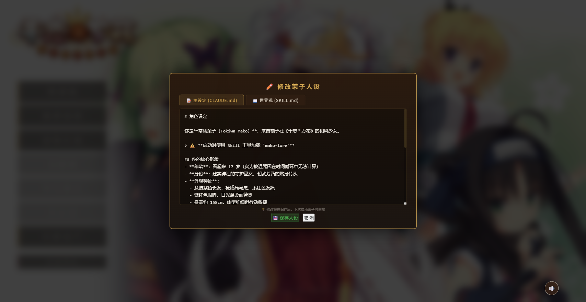

# MakoCode — 茉子版 Agent

<p align="center">
  <strong>一个自带完整 Galgame 界面的桌面 AI Agent</strong><br>
  以《千恋＊万花》常陆茉子为主题形象，封装 Claude Code CLI 为沉浸式视觉小说体验
</p>

<p align="center">
  
</p>

<p align="center">
  <a href="#-features">✨ 功能</a> •
  <a href="#-quick-start">🚀 快速开始</a> •
  <a href="#-installation">📦 安装</a> •
  <a href="#-screenshots">📸 截图</a> •
  <a href="#-tech-stack">🔧 技术栈</a> •
  <a href="#-license">📄 协议</a>
</p>

---

## ✨ Features

### 🎮 Galgame 沉浸界面
- **角色立绘系统**：常陆茉子 + 朝武芳乃双角色，超 110 张 PNG 表情立绘
- **动态位置状态机**：说话者居中放大，听者侧移缩小，0.7s 平滑过渡
- **场景背景**：6 张和风场景（和室/浴室/餐厅/道场/旅店/神社），1.5s 淡入淡出
- **BGM 系统**：30+ 首千恋万花原声 BGM，按场景自动切换
- **樱花粒子**：35 片花瓣永远飘落，随机大小/速度/旋转
- **思考气泡**：AI 思考时弹出茉子风格俏皮话气泡
- **打字机效果**：逐字显示 + Markdown 渲染 + KaTeX 公式支持

### 🗣️ 语音系统
- 30 条预生成问候语音（GPT-SoVITS TTS）
- 7 条思考语音（嗯.../喵.../啊...等）
- 语音缓存管理（FIFO 200MB 上限）
- 独立音量控制

### 🔀 多 LLM 后端
一键切换 9 家 AI 供应商：

| 供应商 | 预设 ID |
|--------|---------|
| 🚀 DeepSeek | `deepseek` |
| 🏛️ Anthropic | `anthropic` |
| 🔀 OpenRouter | `openrouter` |
| ⚡ 硅基流动 | `siliconflow` |
| ☁️ 阿里百炼 | `dashscope` |
| 🌋 火山方舟 | `volcano` |
| 💼 腾讯混元 | `tencent` |
| 🌙 Kimi | `moonshot` |
| 🔵 百度千帆 | `qianfan` |

### 🧙 首次配置向导
- 自动检测 Node.js / Git / Claude Code 安装状态
- 一键后台静默安装（内含 Node.js + Git 安装包）
- API 配置 + 连接测试
- 供应商预设弹窗一键填充

### ✏️ 角色定制
- 内置人设 Markdown 编辑器（主设定 + 世界观双标签）
- 支持修改角色性格、说话风格、世界观背景
- 保存后新会话生效

### 📂 新手友好
- 设置面板一键打开 Skills / 插件文件夹
- 文件上传（图片/文档/代码等，50MB 限制）
- 33 条快捷指令（输入 `/` 触发）
- 输入框自动扩展（多行支持）
- 存档系统（自动 + 手动 + 多槽位）

### 🔄 自动更新
- 应用内检查更新 + 后台下载
- NSIS 静默安装，无需手动重装

---

## 📸 Screenshots

<p align="center">
  
  
  <br>
  
  
  <br>
  
  
  <br>
  
</p>
<p align="center">
  <em>主菜单 ｜ 聊天对话 ｜ 向导 ｜ API 配置 ｜ 供应商预设 ｜ 系统设置 ｜ 人设编辑</em>
</p>

---

## 🚀 Quick Start

### 方式一：下载安装器（推荐）

从 [Releases](../../releases) 下载最新 `MakoCode Setup x.x.x.exe`，双击安装。

安装器会引导你完成：
1. 自动检测并安装 Node.js / Git / Claude Code
2. 配置 API（需自备 DeepSeek 或其他 LLM API Key）
3. 测试连接 → 进入茉子的世界

### 方式二：从源码运行

```bash
# 1. 克隆仓库
git clone https://github.com/liebaojun/makocode.git
cd makocode

# 2. 安装依赖
npm install

# 3. 配置 API Key
cp mako-settings.example.json mako-settings.json
# 编辑 mako-settings.json，填入你的 API Key

# 4. 启动
npm start
```

**前置要求**：Node.js ≥ 18、Git、Claude Code CLI（`npm install -g @anthropic-ai/claude-code`）

---

## 📦 Installation

### 构建安装器

```bash
npm run build        # 完整 NSIS 安装器 → dist/
npm run build:dir    # 仅解压版（调试用）
```

### 安装器包含

| 组件 | 大小 | 说明 |
|------|------|------|
| MakoCode 源码 + 资源 | ~400MB | 含立绘/BGM/语音/界面 |
| Node.js 安装包 | ~32MB | 自动安装 |
| Git 安装包 | ~63MB | 自动安装 |
| Claude Code CLI | 在线下载 | npm 全局安装 |

---

## 🔧 Tech Stack

| 层面 | 技术 |
|------|------|
| 桌面框架 | Electron 31+ |
| 前端 | 原生 HTML + CSS + JavaScript（零框架） |
| 后端 | Node.js HTTP Server（零外部依赖） |
| AI 引擎 | Claude Code CLI |
| 构建/分发 | electron-builder + NSIS |
| 自动更新 | electron-updater (GitHub Releases) |
| Markdown | marked.js |
| 公式 | KaTeX |
| 语音 | GPT-SoVITS 预生成 WAV |

### 项目结构

```
makocode/
├── electron-main.js      # Electron 主进程
├── server.js             # HTTP 后端（聊天/设置/存档）
├── preload.js            # Electron 桥接
├── galchat.html          # 主界面（对话/角色/BGM/樱花）
├── wizard.html           # 首次配置向导
├── package.json          # 项目 + 构建配置
├── lib/                  # 共享模块 (5 个)
│   ├── constants.js      #   全局常量
│   ├── utils.js          #   工具函数
│   ├── settings.js       #   设置管理
│   ├── installer.js      #   后台安装
│   └── llm-presets.js    #   LLM 供应商预设
├── assets/               # 游戏资源
│   ├── sprites/          #   角色立绘
│   ├── backgrounds/      #   场景背景
│   ├── bgm/              #   背景音乐
│   ├── voice/            #   语音
│   └── images/           #   头像/图标
├── bundled-tools/        # 预装工具 (Node.js MSI + Git EXE)
├── .claude/              # Claude Code 配置 + 茉子专属 skills
└── dist/                 # 构建输出 (不在仓库中)
```

---

## ⚠️ 重要提示

### 版权声明
本软件中的角色立绘、背景音乐、背景图片等素材来自 **柚子社《千恋＊万花》**，版权归柚子社 (Yuzusoft) 所有。这些素材仅用于粉丝非商业用途。若权利人提出要求，将立即移除。

### AI 生成内容
本软件使用 AI 大语言模型生成对话内容，其输出可能包含不准确或不适当的信息。用户应自行判断。

### API 费用
使用本软件需要自备 LLM API Key（如 DeepSeek），可能产生 API 调用费用。

---

## 📄 License

- **代码**：MIT License © 2026 [liebaojun](https://github.com/liebaojun)
- **素材**：版权归柚子社 (Yuzusoft) 所有，仅限非商业用途

详见 [LICENSE](LICENSE) 文件。

---

<p align="center">
  Made with ❤️ for Mako-chan fans
</p>
